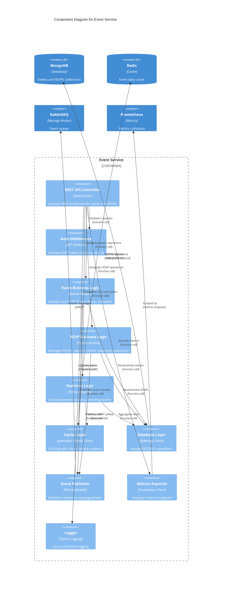

# C4 Component Diagram - Event Service

## Internal Architecture of Event Service

This diagram shows the internal components of the Event Service (Python/Flask).



## Component Responsibilities

### REST API Controller (`api`)
**File**: `app.py` (lines 91-257)
- Route handlers for all endpoints
- Request parsing and validation
- Response formatting
- Error handling
- HTTP status code management

**Endpoints**:
- `GET /health` - Health check
- `GET /api/events` - List events (paginated, filtered)
- `POST /api/events` - Create event (auth required)
- `GET /api/events/{id}` - Get event details
- `PUT /api/events/{id}` - Update event (auth required)
- `DELETE /api/events/{id}` - Delete event (auth required)
- `POST /api/events/{id}/rsvp` - RSVP to event (auth required)
- `DELETE /api/events/{id}/rsvps/me` - Cancel RSVP (auth required)
- `GET /api/events/stats` - Event statistics
- `GET /metrics` - Prometheus metrics

### Auth Middleware (`auth`)
**File**: `app.py` (lines 79-89)
- Extracts JWT from Authorization header or x-user-id header
- Validates JWT signature using JWT_SECRET
- Decodes token payload
- Returns user_id or None
- Used by protected endpoints

**Flow**:
```python
Authorization: Bearer <token>
↓
JWT validation
↓
Extract user_id from payload
↓
Attach to request context
```

### Event Business Logic (`eventLogic`)
**Responsibilities**:
- Event creation with validation
- Event updates with ownership checks
- Event deletion with cascade (RSVPs)
- Event retrieval with caching
- Event filtering by category, date, search
- Pagination logic
- Cache invalidation on updates

**Validation Rules**:
- Required fields: title, date, location, category
- Date must be in future
- Category must be valid enum
- Max capacity must be positive

### RSVP Business Logic (`rsvpLogic`)
**Responsibilities**:
- RSVP creation with duplicate check
- Capacity validation
- RSVP cancellation
- RSVP listing per event
- Attendee count management

**Business Rules**:
- User can RSVP only once per event
- RSVP rejected if event at capacity
- RSVP creates notification event
- Cancellation updates attendee count

### Statistics Logic (`statsLogic`)
**Responsibilities**:
- Total events count
- Total RSVPs count
- Trending events calculation
- Category distribution
- Cache statistics results (TTL: 5 min)

**Trending Algorithm**:
- Sorts by RSVP count descending
- Returns top 10 events
- Updates every 5 minutes via cache

### Cache Layer (`cacheLayer`)
**File**: `app.py` (lines 111-143)
- Wraps Redis operations with circuit breaker
- Graceful fallback to database on cache failure
- TTL management (default: 5 minutes)
- Pattern-based cache invalidation
- Handles Redis connection errors

**Circuit Breaker Config**:
- Fail threshold: 5 failures
- Reset timeout: 30 seconds
- States: Closed → Open → Half-Open

### Database Layer (`dbLayer`)
**File**: `app.py` (lines 21-25)
- MongoDB client initialization
- Collections: `events`, `rsvps`
- CRUD operations
- Aggregation queries for statistics
- Index management (category, date, creator_id)

**Schema**:
```json
Event {
  _id: ObjectId,
  title: string,
  description: string,
  date: ISODate,
  location: string,
  category: string,
  max_capacity: int,
  current_attendees: int,
  creator_id: string,
  created_at: ISODate,
  updated_at: ISODate
}

RSVP {
  _id: ObjectId,
  event_id: string,
  user_id: string,
  created_at: ISODate
}
```

### Event Publisher (`eventPublisher`)
**File**: `app.py` (lines 91-100)
- RabbitMQ connection management
- Exchange declaration: `eventify.events` (topic, durable)
- Message publishing with routing keys
- Persistent delivery mode
- Handles broker unavailability

**Published Events**:
- `events.created` - New event created
- `events.rsvp_added` - User RSVP'd to event
- `events.updated` - Event details changed
- `events.deleted` - Event removed

### Metrics Exporter (`metrics`)
**File**: `app.py` (lines 54-65)
- Prometheus Counter for requests
- Labels: method, endpoint, status
- HTTP metrics endpoint at `/metrics`
- Thread-safe metric updates

**Metrics Exposed**:
- `event_service_requests_total` - Total requests by endpoint and status
- Default Prometheus metrics (CPU, memory, etc.)

### Logger (`logger`)
**File**: `app.py` (uses Flask default logger)
- Structured logging
- Request/response logging
- Error logging with stack traces
- Performance logging
- Ready for centralized logging integration

## Data Flow Examples

### Create Event Flow
```
1. POST /api/events
   ↓
2. API Controller validates request
   ↓
3. Auth Middleware extracts user_id from JWT
   ↓
4. Event Logic validates event data
   ↓
5. Database Layer inserts event to MongoDB
   ↓
6. Cache Layer invalidates "events:*" cache
   ↓
7. Event Publisher publishes "events.created" to RabbitMQ
   ↓
8. Metrics records request
   ↓
9. Logger logs event creation
   ↓
10. API Controller returns 201 Created
```

### List Events Flow (Cached)
```
1. GET /api/events?page=1
   ↓
2. API Controller parses query params
   ↓
3. Event Logic checks cache with key "events:page:1"
   ↓
4. Cache Layer → Redis (HIT)
   ↓
5. Return cached data (5ms response)
```

### List Events Flow (Cache Miss)
```
1. GET /api/events?page=1
   ↓
2. Event Logic checks cache (MISS)
   ↓
3. Database Layer queries MongoDB
   ↓
4. Event Logic formats results
   ↓
5. Cache Layer stores in Redis (TTL: 5min)
   ↓
6. Return fresh data (50ms response)
```

### RSVP Flow with Circuit Breaker
```
1. POST /api/events/{id}/rsvp
   ↓
2. Auth Middleware validates JWT
   ↓
3. RSVP Logic checks capacity
   ↓
4. Database Layer inserts RSVP
   ↓
5. Event Publisher attempts RabbitMQ publish
   ↓
6. RabbitMQ unavailable → Circuit Breaker opens
   ↓
7. Event Publisher logs failure, continues
   ↓
8. API Controller returns 201 (RSVP saved, notification delayed)
```

## Resilience Patterns

### Circuit Breaker (pybreaker)
- Applied to: Redis cache operations
- Applied to: RabbitMQ publishing (implicit)
- Protects against cascading failures
- Allows system degradation instead of complete failure

### Retry Logic
- Database operations: Automatic retry on transient failures
- RabbitMQ: Reconnection on connection loss

### Fallback Strategies
- Cache failure → Direct database query
- RabbitMQ failure → Log error, continue operation (async notification delayed)

## Performance Optimizations

### Caching Strategy
- Event list cached by page number
- Event details cached by ID
- Statistics cached for 5 minutes
- Cache hit ratio: 80-90% (per load tests)

### Database Indexes
- `events.category` - Filter by category
- `events.date` - Sort by date, filter by date range
- `events.creator_id` - Filter by creator
- `rsvps.event_id` - Fast RSVP lookups
- `rsvps.user_id` - Duplicate check

### Query Optimization
- Pagination with skip/limit
- Projection to reduce data transfer
- Aggregation pipelines for statistics
- Compound indexes for common queries

## Testing Strategy

### Unit Tests
- Mock MongoDB client
- Mock Redis client
- Mock RabbitMQ channel
- Test business logic in isolation
- 11 unit tests (all passing)

### Integration Tests
- Real MongoDB instance
- Test API endpoints
- Test database interactions
- 9 integration tests (all passing)

### Load Tests
- k6 load testing
- 1659 requests, 0% error rate
- p95 latency: 85.93ms
- Sustained throughput: 26.5 req/s
