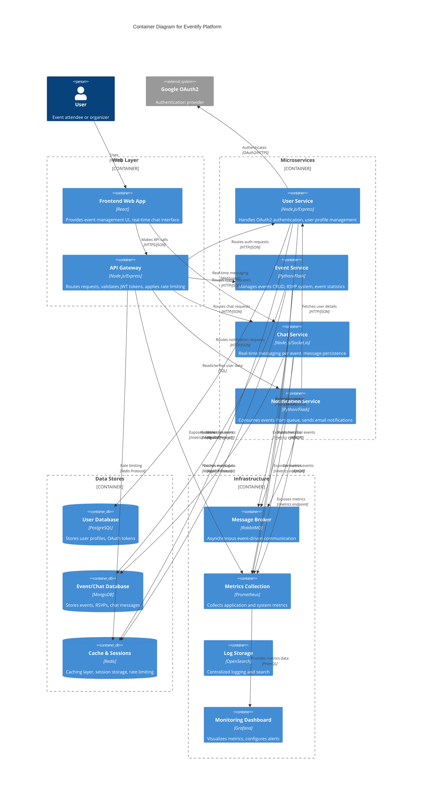

# C4 Container Diagram - Eventify Platform

## Container Architecture

This diagram shows the high-level technology choices and how containers communicate.

## Container Responsibilities

### Web Layer

**Frontend (React)**
- Single Page Application
- Event browsing and filtering
- Event creation forms
- RSVP management
- Real-time chat interface
- User profile management

**API Gateway (Node.js/Express)**
- Single entry point for all client requests
- JWT token validation
- Request routing to microservices
- Rate limiting (10k requests/min)
- Security headers (Helmet.js)
- CORS management
- Request/response logging

### Microservices

**User Service (Node.js/Express)**
- Google OAuth2 integration (Passport.js)
- JWT token generation and refresh
- User profile CRUD
- Session management
- User authentication and authorization

**Event Service (Python/Flask)**
- Event CRUD operations
- RSVP management
- Event statistics calculation
- Event filtering and pagination
- Redis caching for performance
- Event creation publishes to RabbitMQ

**Chat Service (Node.js/Socket.io)**
- WebSocket server for real-time messaging
- Per-event chat rooms
- Message persistence to MongoDB
- Online presence tracking
- Chat history retrieval

**Notification Service (Python/Flask)**
- RabbitMQ consumer
- Email notification sending
- Notification history tracking
- Configurable notification preferences

### Data Stores

**PostgreSQL (User Database)**
- User profiles
- OAuth tokens
- Refresh tokens
- User roles and permissions
- Designed for relational user data

**MongoDB (Event/Chat Database)**
- Events collection (sharded by event_id)
- RSVPs collection
- Chat messages collection
- Supports flexible schema for events
- Optimized for high read/write throughput

**Redis (Cache & Sessions)**
- Event data caching (TTL: 5 minutes)
- Session storage
- Rate limiting counters
- Temporary data storage
- Circuit breaker state

### Infrastructure

**RabbitMQ (Message Broker)**
- Topic exchange: `eventify.events`
- Routing keys: `events.created`, `events.updated`, `events.rsvp_added`
- Durable queues
- Dead letter queues for failed messages
- Enables async event-driven architecture

**Prometheus (Metrics Collection)**
- Scrapes /metrics endpoints every 15s
- Stores time-series metrics data
- Provides PromQL query interface
- Retention: 15 days

**OpenSearch (Log Storage)**
- Centralized log aggregation
- Full-text search capabilities
- Log retention and indexing
- OpenSearch Dashboards for visualization

**Grafana (Monitoring Dashboard)**
- Pre-configured Eventify dashboard
- Real-time metrics visualization
- Alert rule configuration
- Integration with Prometheus

## Technology Choices

| Component | Technology | Justification |
|-----------|-----------|---------------|
| Frontend | React | Modern, component-based, large ecosystem |
| API Gateway | Node.js/Express | Fast, async I/O, easy proxy configuration |
| User Service | Node.js/Express | OAuth2 libraries (Passport.js) |
| Event Service | Python/Flask | Strong data science libraries, team expertise |
| Chat Service | Node.js/Socket.io | Native WebSocket support |
| Notification Service | Python/Flask | Email libraries, async task handling |
| User DB | PostgreSQL | ACID compliance for user data |
| Event/Chat DB | MongoDB | Flexible schema, horizontal scaling |
| Cache | Redis | Sub-millisecond latency, atomic operations |
| Message Broker | RabbitMQ | Reliable delivery, flexible routing |
| Monitoring | Prometheus/Grafana | Industry standard, rich ecosystem |
| Logging | OpenSearch | Open source, powerful search |

## Communication Patterns

### Synchronous (REST/HTTP)
- Frontend ↔ API Gateway
- API Gateway ↔ Microservices
- Microservices ↔ Databases
- Notification Service → User Service (user lookup)

### Asynchronous (Message Broker)
- Event Service → RabbitMQ (event created, RSVP added)
- RabbitMQ → Notification Service (consume events)

### Real-time (WebSocket)
- Frontend ↔ Chat Service (bidirectional messaging)

## Ports

| Container | Port | Purpose |
|-----------|------|---------|
| Frontend | 3080 | Web UI |
| API Gateway | 3000 | REST API |
| User Service | 3001 | Internal API |
| Chat Service | 3002 | WebSocket + REST |
| Event Service | 5001 | Internal API |
| Notification Service | 5002 | Internal API |
| PostgreSQL | 5432 | Database |
| MongoDB | 27017 | Database |
| Redis | 6379 | Cache |
| RabbitMQ | 5672, 15672 | AMQP, Management UI |
| Prometheus | 9090 | Metrics UI |
| Grafana | 3030 | Dashboard UI |
| OpenSearch | 9200 | REST API |
| OpenSearch Dashboards | 5601 | Log UI |
