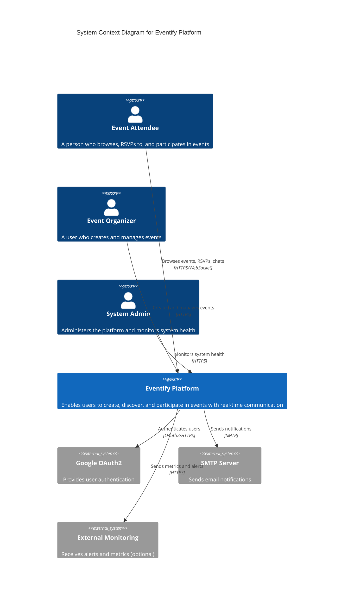

# C4 Context Diagram - Eventify Platform

## System Context

This diagram shows the Eventify Platform in the context of its users and external systems.

## External Dependencies

1. **Google OAuth2**: User authentication and profile data
2. **SMTP Server**: Email notifications for event updates and RSVPs
3. **External Monitoring** (Optional): Integration with external monitoring services

## User Types

1. **Event Attendee**: 
   - Browse events
   - RSVP to events
   - Participate in event chats
   - Receive notifications

2. **Event Organizer**: 
   - All attendee capabilities
   - Create events
   - Manage event details
   - View event statistics
   - Manage attendees

3. **System Admin**:
   - Access monitoring dashboards
   - View system metrics
   - Manage system configuration
   - View logs

## System Boundaries

The Eventify Platform boundary includes:
- All microservices
- Internal databases
- Message queues
- Caching layer
- Monitoring infrastructure
- Logging infrastructure

External to the system:
- User devices (browsers, mobile apps)
- OAuth2 providers
- Email services
- External monitoring services
